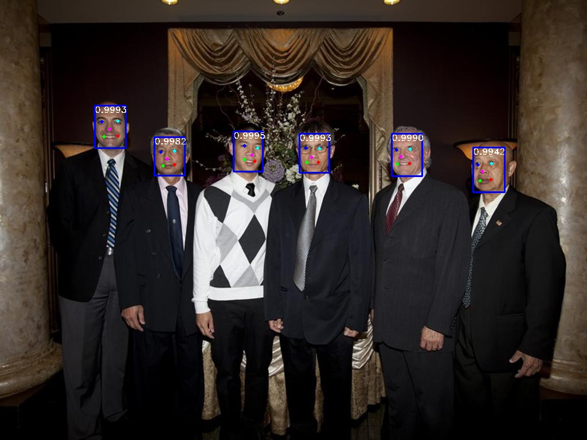
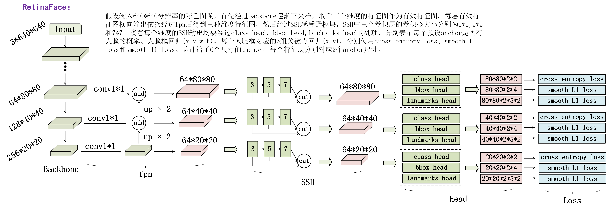

# RetinaFace
face and 5 landmarks detection  
 
## Dependencies
+ pyTorch (1.4.0+)
+ python (3.5.0+)
+ cuda-toolkit(9.0+)
+ torchvision (0.2.0+)
+ tensorboard (1.6.0)

## Networks
 

## Acknowledgement
This work is mainly inspired by  
paper: [RetinaFace：Single-stage Dense Face Localisation in the Wild(CVPR2020)](https://openaccess.thecvf.com/content_CVPR_2020/papers/Deng_RetinaFace_Single-Shot_Multi-Level_Face_Localisation_in_the_Wild_CVPR_2020_paper.pdf)  
projects: [insightface](https://github.com/deepinsight/insightface),[ssd.pytorch](https://github.com/amdegroot/ssd.pytorch),[Pytorch_Retinaface](https://github.com/biubug6/Pytorch_Retinaface),[retinaface-pytorch](https://github.com/bubbliiiing/retinaface-pytorch),[retinaface](https://github.com/serengil/retinaface), 
and [pytorch-retinanet](https://github.com/yhenon/pytorch-retinanet).
